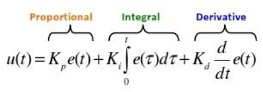

## REFLECTIONS

The PID controller is a very simple 2-step process that seeks to minimize the difference, which we'll call Cross Track Error (CTE), between a current output value and some target value. PID stands for Proportional, Integral, and Derivative, which are weighted terms in a very simple equation.

*source: [Research Gate](https://www.researchgate.net/figure/281746636_fig4_Figure-5-PID-Equation)*

#### Proportional
* This term attempts to correct **in proportion** to the current error. However, when the error correction is not instantaneous, as is the case with a steering vehicle, it tends to overshoot the goal value, which creates an oscillating behavior, as the car continually corrects, overshoots and then attempts to correct again. This is obviously not desirable and in fact can be dangerous if the oscillations cause the car to veer out of its lane or off the road entirely.

#### Derivative
* This term acts as a damper for the Proportional control. It has the effect of slowing down the error correction according to its rate of change. This can correct the overshooting, oscillating behavior created by the Proportional control and help the CTE converge more smoothly towards zero.

#### Integral
* The term is used to correct bias in the system, such as a vehicle whose wheels are not perfectly aligned, which would otherwise prevent the controller from converging. When there is no bias or the bias is extremely small, this term may not be necessary.

### Weighting the Terms

The weights on each of the terms affect the behavior of the controller. More weight applied to the Proportional term will cause the vehicle to attempt to correct any error more aggressively. More weight applied to the Derivative term will cause the vehicle to have a smoother, but slower response. And more weight on the Integral term will attempt to correct for more bias.

In the case of this project, I chose to manually tune the weights applied to each term in order to get a good feel for how they affect the control of the car.

Running at lower speeds, this is fairly straightforward, but as the vehicle drives faster, it becomes more important to carefully balance the P and D terms, as too much weight applied to the Proportional term will cause the car to oscillate wildly, and too much weight applied to the Derivative term will result in the car careening off the side of the road when it encounters a sharp turn. There appears to be little to no bias in the system, so I set the Integral weight to zero.

### Running the Simulator

At each time step in the simulator, we are given the current speed, steering angle, and the cross track error, which is presumably how much our vehicle is deviating from an ideal path. The cross track error is fed into the controller to update its PID terms and then the weighted sum is passed back to the simulator to update the steering angle, as well as the throttle.

### Controlling the throttle

Rather than simply hardcoding the throttle value, I added an additional PID controller that outputs a throttle value. This enables the car to lower its throttle or even apply negative throttle, effectively slamming the brakes if the CTE becomes too great. However, in some cases, when the throttle controller attempts to correct the speed, it can overcompensate with a very negative value, which can compound the error until the car cannot recover. For this reason, I clamped the throttle value so that it cannot go below -0.1 or above 0.75 (75% of the max speed). Because I want the throttle to respond quickly, and because oscillating throttle is not going to cause the same problems as steering, most of the weight is applied to the Proportional term.
